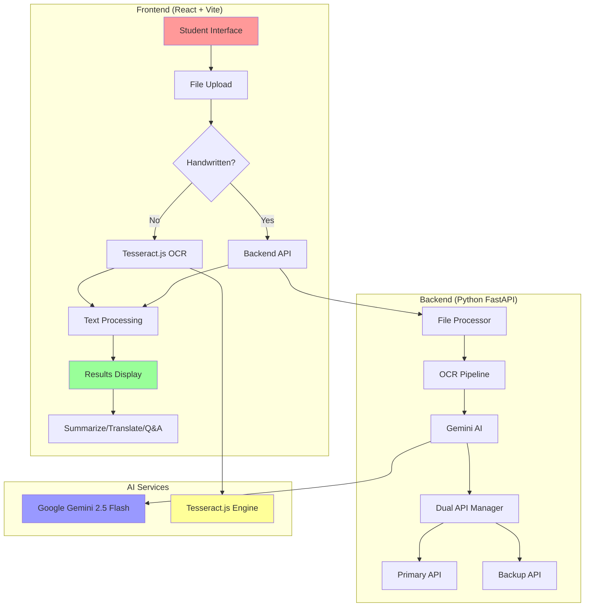
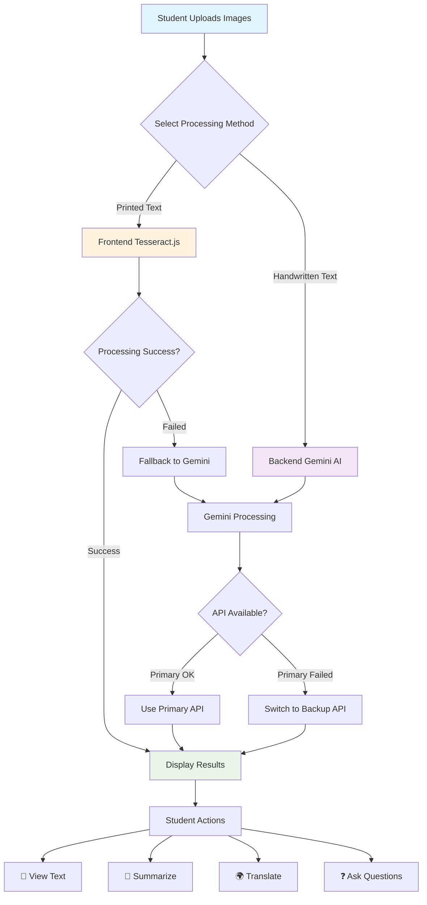
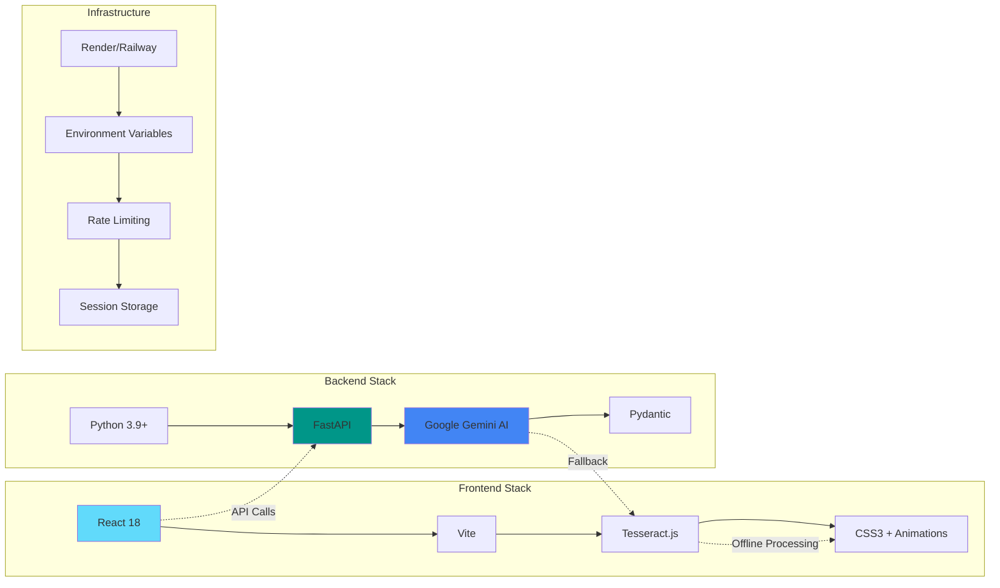

# 🚀 KiddyVerse - Where Learning Meets Magic ✨

<div align="center">


**An AI-powered educational assistant designed specifically for students grades 3-10**

[🎯 Features](#-features) • [🏗️ Architecture](#️-architecture) • [🚀 Quick Start](#-quick-start) • [📱 Demo](#-demo) • [🤝 Contributing](#-contributing)

</div>

---

## 🌟 Overview

KiddyVerse is a magical learning companion that transforms homework into an interactive experience! Students can upload images of their textbooks, worksheets, or handwritten notes, and our AI will help them extract text, create summaries, translate content, and answer questions - all with a student-friendly interface designed for young learners.

### 🎯 Key Highlights

- 🔮 **Smart OCR**: Dual-mode processing (offline Tesseract.js + online Gemini AI)
- 🎨 **Student-Friendly UI**: Colorful, animated, and touch-optimized design
- 📱 **Mobile-First**: Works perfectly on phones, tablets, and computers
- ⚡ **Offline Capable**: Process printed text without internet connection
- 🌍 **Multi-Language**: Translate content to any language
- 🤖 **AI-Powered**: Grade-appropriate summaries and intelligent Q&A
- 🔄 **Dual API Failover**: Automatic backup system for reliability

---

## 🏗️ Architecture

### System Overview



### Smart OCR Processing Flow



### Technology Stack



---

## ✨ Features

### 🎯 Core Functionality

| Feature | Description | Technology |
|---------|-------------|------------|
| **Smart OCR** | Dual-mode text extraction with automatic fallback | Tesseract.js + Gemini AI |
| **File Processing** | Support for images (JPG, PNG, GIF, BMP) up to 5 files | Python PIL + FastAPI |
| **Text Summarization** | Grade-appropriate summaries (Grades 3-10) | Gemini AI with custom prompts |
| **Multi-Language Translation** | Translate to any language | Gemini AI translation |
| **Intelligent Q&A** | Ask questions about extracted content | Gemini AI with context |
| **Offline Processing** | Works without internet for printed text | Tesseract.js in browser |

### 🎨 Student-Friendly Design

- **🌈 Colorful Interface**: Vibrant gradients and animations
- **📱 Touch-Optimized**: 44px+ touch targets for mobile devices
- **🎭 Engaging Animations**: Bounce, wiggle, and glow effects
- **🎯 Clear Navigation**: Prominent tabs with descriptive labels
- **💬 Encouraging Language**: Positive, supportive messaging
- **🔄 Visual Feedback**: Progress indicators and status updates
- **💭 Feedback System**: Integrated Formspree feedback collection

### 🛡️ Reliability Features

- **🔄 Dual API System**: Automatic failover between API keys
- **⚡ Smart Fallback**: Tesseract failure → Gemini backup
- **🚦 Rate Limiting**: Prevents API abuse and overuse
- **💾 Session Storage**: Temporary file management
- **🔒 Input Validation**: File type and size restrictions
- **📊 Error Handling**: Student-friendly error messages

---

## 🚀 Quick Start

### Prerequisites

- **Node.js** 18+ (for frontend)
- **Python** 3.9+ (for backend)
- **Google Gemini API Keys** (2 keys recommended)

### 1. Clone Repository

```bash
git clone https://github.com/Sunilk240/kiddyverse.git
cd kiddyverse
```

### 2. Backend Setup

```bash
cd backend

# Create virtual environment
python -m venv .venv
source .venv/bin/activate  # On Windows: .venv\Scripts\activate

# Install dependencies
pip install -r requirements.txt

# Create .env file
cp .env.example .env
# Add your Gemini API keys to .env

# Start backend
python main.py
```

### 3. Frontend Setup

```bash
cd frontend

# Install dependencies
npm install

# Create .env file
cp .env.example .env
# Set VITE_API_BASE_URL=http://localhost:8080

# Start frontend
npm run dev
```

### 4. Open Application

Visit `http://localhost:5173` in your browser and start learning! 🎉

---

## 📱 Demo

### Student Workflow

1. **📁 Upload**: Drag & drop homework images
2. **⚙️ Choose Method**: Select printed or handwritten text
3. **🔄 Process**: Watch the magic happen with progress indicators
4. **🎯 Interact**: Use the prominent action tabs:
   - 📄 **View Text**: See extracted content
   - 📝 **Summarize**: Get grade-appropriate summaries
   - 🌍 **Translate**: Convert to any language
   - ❓ **Ask Questions**: Get intelligent answers

### Screenshots

```
┌─────────────────────────────────────┐
│  🚀 KiddyVerse - Where Learning     │
│      Meets Magic ✨                 │
├─────────────────────────────────────┤
│                                     │
│  📁 Upload Your Files               │
│  ┌─────────────────────────────────┐ │
│  │  📎 Drop files here or click   │ │
│  │     to browse                  │ │
│  └─────────────────────────────────┘ │
│                                     │
│  ✍️ Contains handwritten text?      │
│  ☐ Will use fast offline processing │
│                                     │
│  🚀 Process Files Now! ✨           │
└─────────────────────────────────────┘
```

---

## 🔧 Configuration

### Environment Variables

#### Frontend (.env)
```env
VITE_API_BASE_URL=http://localhost:8080
VITE_MAX_PDF_MB=10
VITE_MAX_IMAGES=5

# Optional: Feedback Form (Formspree)
VITE_FORMSPREE_ID=your_formspree_form_id
```

#### Backend (.env)
```env
# Server Configuration
PORT=8080
ALLOWED_ORIGIN=http://localhost:5173
RATE_LIMIT_RPM=60

# Dual Gemini API Keys
GEMINI_API_KEY_1=your_primary_api_key_here
GEMINI_API_KEY_2=your_backup_api_key_here

# AI Models
MODEL_OCR=gemini-2.5-flash
MODEL_SUMMARIZE=gemini-2.5-flash
MODEL_TRANSLATE=gemini-2.5-flash
MODEL_QA=gemini-2.5-flash

# File Processing Limits
MAX_IMAGES=5
MAX_PDF_PAGES=5
MAX_FILE_SIZE_MB=10
```

---

## 🚀 Deployment

### Frontend (Vercel/Netlify)

```bash
# Build command
npm run build

# Output directory
dist/

# Environment variables
VITE_API_BASE_URL=https://your-backend-url.com
```

### Backend (Render/Railway)

```bash
# Build command
pip install -r requirements.txt

# Start command
python main.py

# Environment variables
# (Set all backend .env variables in your platform)
```

For detailed deployment instructions, see [DEPLOYMENT.md](DEPLOYMENT.md).

---

## 🧪 API Documentation

### Endpoints

| Endpoint | Method | Description |
|----------|--------|-------------|
| `/health` | GET | Health check and API status |
| `/upload-files` | POST | Upload and validate files |
| `/extract-text` | POST | OCR processing with Gemini |
| `/summarize` | POST | Generate grade-appropriate summaries |
| `/translate` | POST | Translate text to target language |
| `/qa` | POST | Answer questions about content |

### Example API Call

```javascript
// Summarize text
const response = await fetch('/summarize', {
  method: 'POST',
  headers: { 'Content-Type': 'application/json' },
  body: JSON.stringify({
    text: "Your extracted text here...",
    classLevel: "7"
  })
});
```

---

## 🤝 Contributing

We welcome contributions from educators, developers, and students! Here's how you can help:

### 🎯 Ways to Contribute

- 🐛 **Bug Reports**: Found an issue? Let us know!
- 💡 **Feature Requests**: Have ideas for new features?
- 🎨 **UI/UX Improvements**: Make it even more student-friendly
- 📚 **Documentation**: Help improve our guides
- 🌍 **Translations**: Add support for more languages
- 🧪 **Testing**: Help us test with real student scenarios

### 📋 Development Setup

1. Fork the repository
2. Create a feature branch: `git checkout -b feature/amazing-feature`
3. Make your changes and test thoroughly
4. Commit with descriptive messages: `git commit -m "Add amazing feature"`
5. Push to your branch: `git push origin feature/amazing-feature`
6. Open a Pull Request

### 🎨 Code Style

- **Frontend**: ESLint + Prettier configuration
- **Backend**: Black formatter + isort
- **Commits**: Use conventional commit messages
- **Documentation**: Update README for new features

---

## 🏆 Acknowledgments

- **Students Everywhere**: For inspiring us to make learning magical
- **Educators**: For feedback on student-friendly design
- **Open Source Community**: For amazing tools and libraries
- **Google Gemini AI**: For powerful language processing
- **Tesseract.js**: For offline OCR capabilities

---

## 🗺️ Roadmap

### 🎯 Version 2.1 (Coming Soon)
- [ ] 🎮 Gamification elements and achievement badges
- [ ] 👥 Multi-user support for classrooms
- [ ] 📊 Learning progress tracking
- [ ] 🎵 Audio feedback and text-to-speech
- [ ] 🖼️ Enhanced image preprocessing

### 🚀 Version 3.0 (Future)
- [ ] 🧠 Personalized learning recommendations
- [ ] 📱 Native mobile apps (iOS/Android)
- [ ] 🌐 Offline-first architecture
- [ ] 🎨 Custom themes and personalization
- [ ] 🤖 Advanced AI tutoring capabilities

---

## 📄 License

This project is licensed under the **MIT License** - see the [LICENSE](#license) file for details.

### MIT License

```
MIT License

Copyright (c) 2024 KiddyVerse Team

Permission is hereby granted, free of charge, to any person obtaining a copy
of this software and associated documentation files (the "Software"), to deal
in the Software without restriction, including without limitation the rights
to use, copy, modify, merge, publish, distribute, sublicense, and/or sell
copies of the Software, and to permit persons to whom the Software is
furnished to do so, subject to the following conditions:

The above copyright notice and this permission notice shall be included in all
copies or substantial portions of the Software.

THE SOFTWARE IS PROVIDED "AS IS", WITHOUT WARRANTY OF ANY KIND, EXPRESS OR
IMPLIED, INCLUDING BUT NOT LIMITED TO THE WARRANTIES OF MERCHANTABILITY,
FITNESS FOR A PARTICULAR PURPOSE AND NONINFRINGEMENT. IN NO EVENT SHALL THE
AUTHORS OR COPYRIGHT HOLDERS BE LIABLE FOR ANY CLAIM, DAMAGES OR OTHER
LIABILITY, WHETHER IN AN ACTION OF CONTRACT, TORT OR OTHERWISE, ARISING FROM,
OUT OF OR IN CONNECTION WITH THE SOFTWARE OR THE USE OR OTHER DEALINGS IN THE
SOFTWARE.
```

---

<div align="center">

**Made with ❤️ for students everywhere**

*KiddyVerse - Where Learning Meets Magic ✨*

</div>